<h1 align="center">Welcome to my GitHub page 👋 </h1>

 
Hey, my name's Oliwier!
I'm an aspiring Front-End Software Engineer currently diving into React,   Typescript and Tailwind CSS through building and testing some cool projects, check them out down below! 😎

<h2 align="center"> My tools 🔨 </h2>

<h2 align="center"> My statistics 📊 </h2>

  

 

